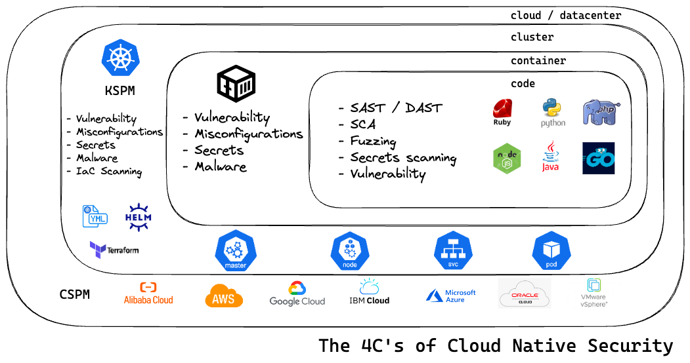
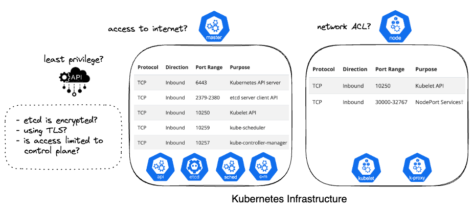
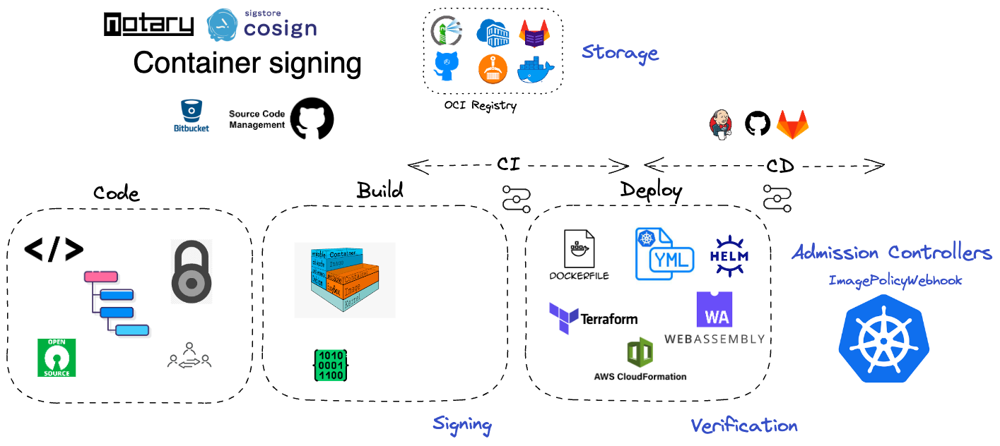

# Kubernetes Security Checklist

## Table of Contents
  - [Kubernetes Infrastructure](#kubernetes-infrastructure)
  - [Kubernetes Security Features](#kubernetes-security-features)
  - [Kubernetes Authorization - RBAC](#kubernetes-authorization---rbac)
  - [Kubernetes Pod Security](#kubernetes-pod-security)
  - [Kubernetes Secrets](#kubernetes-secrets)
  - [Kubernetes Networking](#kubernetes-network-security)
  - [Kubernetes Supply Chain Security](#kubernetes-supply-chain-security)
  - [Common attacks](#common-attacks)
  - [Kubernetes Security Guides](#kubernetes-security-guides)
  - [Further reading](#further-reading)
  - [Collaborate](#collaborate)

---

## Kubernetes Infrastructure

- ✅ Limiting access to the Kubernetes API server except from trusted networks.
  - Limit access to Network API Server (Control plane)
  - Limit access to Network Nodes
  > Ports and Protocols - [kubernetes official doc](https://kubernetes.io/docs/reference/ports-and-protocols/)

- ✅ Limiting access to Kubernetes Cloud Provider API. Apply the least privilege in the Authorization IAM.
- ✅ Limiting access to etcd
  - Apply etcd Encryption
  - Use TLS communication
  - is ETCD access limited to control plane?
- ✅ Apply host security benchmark: OpenSCAP, OVAL. Validate if your hosts are following the CIS benchmark. `Compliance`
- ✅ Updates and patches
  - Update the kubernetes version with the fixed bugs
- ✅ Certs: SSL/TLS for your Kubernetes Cluster
  - Automated issuance and renewal of certificates to secure Ingress with TLS
  - Secure pod-to pod communication with mTLS using private PKI Issuers
  - Supports certificate use cases for web facing and internal workloads

  > [cert-manager](https://cert-manager.io/) is a X.509 certificate controller for Kubernetes and OpenShift workloads.

  > Manage TLS Certificates in a Cluster - [Kubernetes official doc](https://kubernetes.io/docs/tasks/tls/managing-tls-in-a-cluster/)

## Kubernetes Security Features

- ✅ Authorization: RBAC
- ✅ Authentication: SSO
- ✅ Secrets management
- ✅ Pod Security policy
- ✅ Network policy
- ✅ Observability: Auditing API server

## Kubernetes Authorization - RBAC

- ✅ Role-based Access Control - RBAC
  - *Follow the principle of least privilege*
  - Workload identity in Cloud providers: Employ workload identity to tie RBAC to the cloud provider’s authentication mechanism.
  - Avoid admin-level access in the cluster
      - [AquaSecurity/kubectl-who-can](https://github.com/aquasecurity/kubectl-who-can). Show who has RBAC permissions to perform actions on different resources in Kubernetes.
      - [FairwindsOps/rbac-manager](https://github.com/FairwindsOps/rbac-manager). This is an operator that supports declarative configuration for RBAC with new custom resources.

- [Kubernetes RBAC: Asking for Forgiveness or Getting Permission](https://blog.aquasec.com/kubernetes-rbac)
- [Privilege Escalation from Node/Proxy Rights in Kubernetes RBAC](https://blog.aquasec.com/privilege-escalation-kubernetes-rbac)
- [Kubernetes RBAC: How to Avoid Privilege Escalation via Certificate Signing](https://blog.aquasec.com/kubernetes-rbac-privilige-escalation)

## Kubernetes Pod Security
- ✅ [Pod security standards](https://kubernetes.io/docs/concepts/security/pod-security-standards/): Restricted, Baseline and Privileged.
- ✅ Configure a [Security context](https://kubernetes.io/docs/tasks/configure-pod-container/security-context/) for a pod or container.
- ✅ Container runtime with stronger isolation

## Kubernetes Secrets

- ✅ Encrypt all your secrets
    - Mozilla's SOPS
    - Key Management stores in the Cloud Providers

## Kubernetes Network Security

when’s the last time anyone discovered a sophisticated attack from a
packet capture (PCAP) in Kubernetes?

>> [Image by Security Observability with eBPF](https://isovalent.com/data/isovalent_security_observability.pdf)

- ✅  Network Policy
  - Use nano segmentation
  - Use network policy: manage cluster ingress and egress

## Kubernetes Supply Chain Security
- ✅ Enforce image trust with Image signing
  - Image signing: Container Signing, Verification and Storage in an OCI registry.
  - [Cosign vs Notary by Rewanth](cosign-with-kubernetes-ensure-integrity-of-images-before-deployment)
- ✅ Enabled Kubernetes [Admission controllers](https://kubernetes.io/docs/reference/access-authn-authz/admission-controllers/) to verify the image integrity.
- ✅ SCA, SBOM

## Kubernetes Thread Matrix

- [Microsoft Threat Matrix](https://microsoft.github.io/Threat-Matrix-for-Kubernetes/)

## Common Attacks

- Abuse credentials: RBAC, service accounts system:masters
- Poisoned Images / Malicious Images in the registry
  - Supply chain mitigation: Secure Ci/CD env, Image assurance, Image signing
- Privileged Escalation – Breaking out of the Container: Excessive capabiiities such as CAP_SYS_ADMIN, CAP_NET_ADMIN, CAP_SYS_PTRACE
  - Escape to Host- Kubernetes Privilege Pod application
    - writable hostPath mount: Avoid with misconfigurations k8s tools
    - [CVE-2022-0185: Kubernetes Container Escape Using Linux Kernel Exploit](https://www.crowdstrike.com/blog/cve-2022-0185-kubernetes-container-escape-using-linux-kernel-exploit/)

- Backdoor container - Persistence: capture the contents of the service account token mounted in the container
  - [Doki Malware](https://attack.mitre.org/software/S0600/)
  - Used secret management for your application data.
- Cryptominers
  - [Kinsing Malware](https://attack.mitre.org/software/S0599/)
- Laterally moving within the cluster, Network scanning: Avoid with network policy or network segmentation.
- Misconfigured Kubelet API: Avoid with Kubernetes hardening tools.
  - Set to false the `--anonymous-auth` flag in the kubelet component.
  - [Hildegard Malware](https://attack.mitre.org/software/S0601/)
- Application exploit (RCE, SSRF, XXE, etc.)
- Reverse Shell: Remote code execution (RCE) that opens a reverse shell connection to a suspicious domain that the attacker is listening. 
  >> The workload wasn’t restricted by the container runtime and has overly permissive Linux capabilities that
enables the attacker to mount in the /etc/kubernetes/manifests directory from the host into the container.
  >> The attacker then drops a privileged pod manifest in kubelet’s manifest directory. The attacker now has a high-availability, kubelet-managed backdoor into the cluster that supersedes any IAM (identity and access management) or RBAC policies.
- Fileless attacks
- SSRF attacks to the Kubernetes API server

- Denial of Service (DoS) or a Distributed Denial of Service (DDoS): Avoid with misconfigurations k8s tools
  - ✅ Limit the resources (CPU, memory) in the pods
    - [Goldilocks](https://github.com/FairwindsOps/goldilocks) - identify a starting point for resource requests and limits.
  - ✅ Limit the resources (CPU, memory) using Quotes by namespace/cluster.
  - ✅ Set limits about traffic in the ingress policy. You can set limits on the number of concurrent connections, the number of requests per second, minute, or hour; the size of request bodies.
- Fork bomb: Avoid with misconfigurations k8s toolss

## Penetration Kubernetes Tools
- [Peirates](https://github.com/inguardians/peirates)

## Policy as a code
OPA allows users to set policies across infrastructure and applications.

- Standard policies.
- Organization-specific policies
- Environment-specific policies

Some controls examples:
• Which registries images can be downloaded from
• Which OS capabilities a container can execute with
• Which namespaces are allowed to run sensitive workloads
• Labels that must be specified for certain resources
• Disallowing deprecated or dangerous resource types
• Enforcing naming schemes or internal standards

### Integrates shift-left Kubernetes Security
Run security validation checks in your CI/CD pipeline. Check the manifest written in in Yaml, Terraform, etc

- [x] IaC and automation reduce human error by creating predictable results

#### Tools
- [FairwindsOps/Polaris](https://github.com/FairwindsOps/Polaris). Validation of best practices in your Kubernetes clusters.
- [AquaSecurity/appshield](https://github.com/aquasecurity/appshield). Security configuration checks for popular cloud native applications and infrastructure.
- [Trivy-operator]
## Kubernetes Reliability Best Practices
- Simplicity vs Complexity
  - Service delivery vs traffic routing. Manually maintained DNS entries, Service delivery is required because your application is scaling in and out, and changes are happening at a fast rate.
  - Configuration management tools: Puppet, Ansible, Terraform
  - Application configuration: ConfigMaps or Secrets
- High-availability (HA) architecture / fault tolerance
- Resource limits and auto-scaling. *set limits on what a pod can consume to increase reliability. This avoids the noisy neighbor problem*
- Liveness and readiness probes. *configure liveness probes and readiness probes to provide your cluster with the ability to self-heal*

### Key Monitoring Alerts
- Kubernetes deployment with no replicas
- Horizontal Pod Autoscaler (HPA) scaling issues
- Host disk usage
- High IO wait times
- Increased network errors
- Increase in pods crashed
- Unhealthy Kubelets
- nginx config reload failures
- Nodes that are not ready
- Large number of pods that are not in a Running state
- External-DNS errors registering records

## Kubernetes CI/CD Artifacts
- argoCD
- gitops
- terraform
- helm
- Istio help handling mutual TLS encryption inside the cluster.

## Kubernetes Security Guides
- [Kubernetes Hardening Guide by NSA/CISA](https://media.defense.gov/2022/Aug/29/2003066362/-1/-1/0/CTR_KUBERNETES_HARDENING_GUIDANCE_1.2_20220829.PDF)
- [Containers Matrix by Mitre](https://attack.mitre.org/matrices/enterprise/containers/)

## Further reading:
- [Fairwinds - Kubernetes Best Practices](https://f.hubspotusercontent40.net/hubfs/2184645/Kubernetes-Best-Practices-WhitePaper.pdf)
- [Kubernetes Security Cheat Sheet by Owasp](https://cheatsheetseries.owasp.org/cheatsheets/Kubernetes_Security_Cheat_Sheet.html)
- [gaps in your public cloud kubernetes security posture](https://itnext.io/how-to-spot-gaps-in-your-public-cloud-kubernetes-security-posture-b9cd375f1b25)
## Collaborate

If you find any typos, errors, outdated resources; or if you have a different point of view. Please open a pull request or contact me.

Pull requests and stars are always welcome 🙌